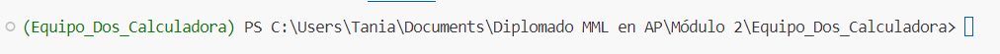
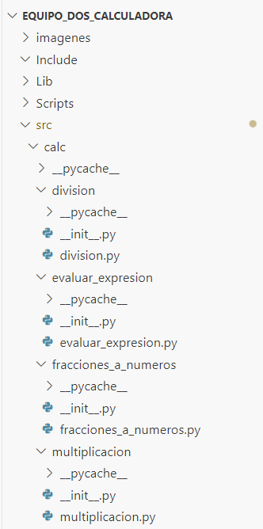
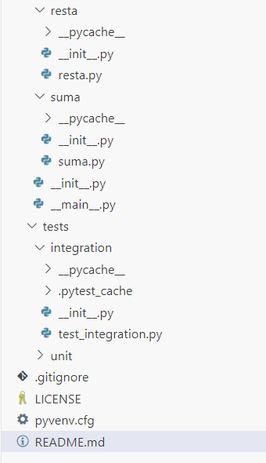
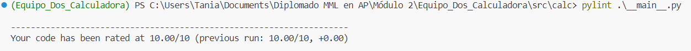
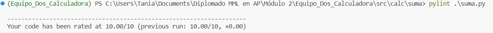
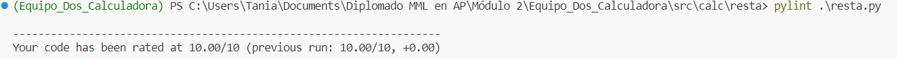
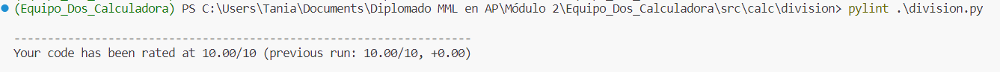
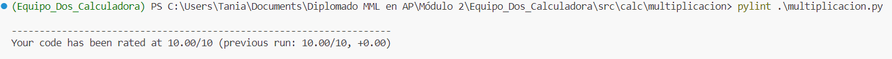
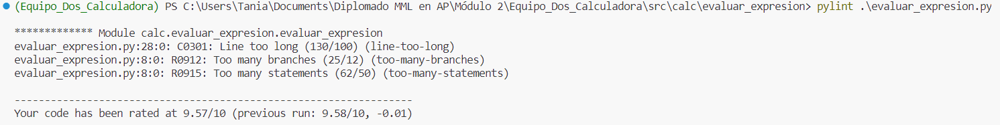
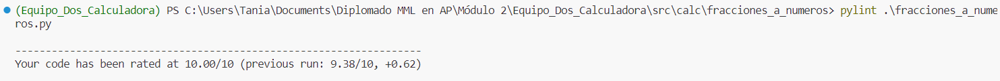

# Equipo Dos: Calculadora

## Requerimientos

### Programar funciones para las 4 operaciones básicas.

En sus equipos, y crear funciones que realicen las 4 operaciones básicas de una calculadora: suma, resta, división y multiplicación.
Recuerde: Las pruebas comienzan desde la toma de requerimientos.

Requerimientos:

1. Las operaciones deben aceptar cualquier número racional Q.
2. El usuario puede ingresar operaciones como una cadena (string) pero solo puede usar número y los operadores : op = {-,+,/,*}.
3. La división entre cero no está permitida. Se pueden agregar condiciones.
4. Los resultados se deben devolver siempre con decimales, aún cuando el resultado sea entero.
5. No usar bibliotecas de terceros.
6. Las funciones deben aceptar tanto cadenas de caracteres como números enteros y decimales en ambos argumentos de la función.

### Creación de pruebas unitarias e integración para la calculadora

Con base en lo aprendido hasta ahora, y el material que se ha compartido, es momento de crear pruebas unitarias y de integración al código/pseudocódigo generado anteriormente.

En sus equipos y crear tanto la estructura como las pruebas para las 4 operaciones básicas de la calculadora.

Pruebas unitarias:

* Suma, resta, multiplicación, división y a la que convierte fracciones a números.

Pruebas de integración:

* Realizar la prueba para la siguiente operación matemática: (num1 + num2) * (num3 - num4) 

Con los siguientes números:
(5+5) * (1.25-0.75) = (10) * (0.5) = 5
(8+7/5) * (15-3/8) = (9.4) * (14.625) = 137.475

## Creación del programa

### Entorno virtual

Para el programa fue creado un entorno virtual llamado "Equipo_Dos_Calculadora":

### Estructura del proyecto

### Linters y Code Formatters

1. **pylint**
    * Archivo: __main__.py
    

    * Archivo: suma.py
    

    * Archivo: resta.py
    

    * Archivo: division.py
    

    * Archivo: multiplicacion.py
    

    * Archivo: evaluar_expresion.py
    

    * Archivo: fracciones_a_numeros.py
    

2. **black**
    * Archivo: __main__.py
    * Archivo: suma.py
    * Archivo: resta.py
    * Archivo: division.py
    * Archivo: multiplicacion.py
    * Archivo: evaluar_expresion.py
    * Archivo: fraacciones_a_numeros.py

### Pruebas

#### Pruebas unitarias

#### Pruebas de integración